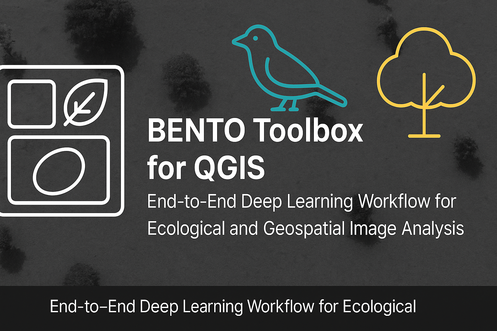
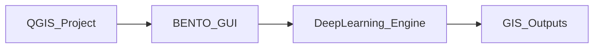

# 🥡 BENTO Toolbox for QGIS

<p align="center">
  
</p>

[](https://qgis.org/)
[](LICENSE)
[](https://www.python.org/)
[](https://pytorch.org/)
[](https://github.com/ultralytics/ultralytics)
[](https://github.com/facebookresearch/detectron2)
[](https://aesparon.github.io/BENTO_QGIS_toolbox/)
[](https://zenodo.org/)  <!-- update once DOI minted -->

---
## 🌏 Overview

**BENTO** (*Bentō toolbox*, inspired by the Japanese lunch box) is an **open-source, modular, and fully integrated geospatial deep learning workflow** built as a **QGIS plugin**.  
It bridges **remote sensing**, **ecological monitoring**, and **AI**, embedding powerful vision workflows directly inside QGIS.

BENTO allows users to:
- Automatically create segmentation masks via **foundation models (SAM)**.
- Train **object detection and segmentation** models (YOLOv8/v11/v12, Detectron2).
- Evaluate and visualize results through **FiftyOne dashboards**.
- Deploy models to new datasets, generating **GIS-ready vector outputs**.

All tasks — from annotation to training and prediction — are handled entirely within QGIS.

---

## 🧠 Key Features

- 🔗 **Seamless QGIS Integration** using PyQGIS and PyQt5.
- 🧩 **Foundation Model Masking** via Meta’s Segment Anything (SAM v2).
- 🤖 **Flexible Model Support**: YOLOv8/v11/v12 and Detectron2 (Mask R-CNN).
- 📏 **Geospatial Outputs**: Predictions saved as shapefiles for direct GIS analysis.
- 🧮 **Integrated Evaluation** with FiftyOne (mAP@50, precision, recall).
- 💻 **Cross-Platform, GUI-Based Workflow** — no code required.
- 🌱 **Designed for Ecology and Remote Sensing** applications:
  - Bird colony detection (e.g., pelicans 🐦)
  - Vegetation mapping and tree segmentation 🌳
  - Marine mammal surveys 🦭

---

## 🧩 System Architecture

BENTO runs as a **QGIS Python plugin**, integrating deep learning frameworks through an isolated Python environment.

**Core components:**
- GUI: PyQt5 / Qt Designer  
- Backend: PyQGIS, PyTorch, Ultralytics YOLO, Detectron2  
- Evaluation: FiftyOne dashboard (launched via browser)  



Outputs (masks, detections, predictions) are automatically added to the active QGIS project.

---

## ⚙️ Installation

### 1. Requirements
- QGIS ≥ 3.30
- Python ≥ 3.10
- PyTorch ≥ 2.0
- CUDA (optional for GPU acceleration)

### 2. Installation via QGIS Plugin Manager
*(coming soon to the QGIS Plugin Repository)*

### 3. Manual Installation
```bash
git clone https://github.com/<your-username>/BENTO-QGIS-Toolbox.git
cd BENTO-QGIS-Toolbox
cp -r BENTO ~/.local/share/QGIS/QGIS3/profiles/default/python/plugins/
```
Then restart QGIS and enable the plugin via:  
> **Plugins → Manage and Install Plugins → BENTO**

### 4. First Launch
On first run, BENTO will:
- Detect or create a **dedicated Python environment**
- Install dependencies automatically (PyTorch, Ultralytics, Detectron2, FiftyOne)
- Register the environment for reuse

---

## 🚀 Workflow

### Step 1 — Mask Creation
- Generate segmentation masks using **SAM v2** from bounding boxes or points.
- Exported as shapefiles directly added to QGIS.

### Step 2 — Model Training
- Supports YOLOv8/11/12 or Detectron2 Mask-RCNN.
- Define training and validation polygons as shapefiles.
- Auto-handles image tiling, annotation formatting, and training execution.

### Step 3 — Model Evaluation
- Evaluate models using unseen test areas.
- Visualize predictions vs. ground truth in **FiftyOne**.
- Metrics: mAP@50, precision, recall, IoU.

### Step 4 — Deployment
- Apply trained models to new imagery.
- Generate shapefile outputs with class, confidence, and ID fields.

---

## 🧪 Case Studies

| Case Study | Target | Model | Outcome |
|-------------|---------|--------|----------|
| Pelican Colony | Waterbirds | YOLOv11 | Automated detection in drone RGB mosaics |
| Tropical Savanna Trees | Vegetation | Mask R-CNN / YOLOv11 | SAM masks enhanced segmentation accuracy |
| Seal Detection | Marine mammals | YOLOv11 | Reliable morphometrics and counts |

---

## 📈 Best Practices

- Tile size ≥ **1.5–2× largest object**.
- Use **50% overlap** between tiles.
- Include **background samples** for better generalization.
- Tune **confidence thresholds** to reduce false positives.

---

## 🛠️ Developer Guide

### Directory Structure
```
BENTO/
 ├── bento_gui/             # PyQt5 GUI forms
 ├── core/                  # Model training, tiling, evaluation logic
 ├── models/                # Pretrained and user-trained models
 ├── utils/                 # Helper scripts (I/O, reprojection, env setup)
 ├── examples/              # Case studies and demo data
 └── docs/                  # Documentation and figures
```

### Technologies
| Component | Technology |
|------------|-------------|
| Plugin Framework | PyQGIS + PyQt5 |
| Model Training | PyTorch, YOLO, Detectron2 |
| Mask Generation | Meta SAM v2 |
| Evaluation | Voxel FiftyOne |
| Environment | Python Virtualenv |

---

## 🧭 Citation

If you use **BENTO** in your research, please cite:

> Esparon, A. et al. (2025).  
> *BENTO: An open-source modular toolbox for geospatial deep learning in QGIS.*  
> *In preparation.*  
> GitHub repository: [https://github.com/aesparon/BENTO_QGIS_toolbox](https://github.com/aesparon/BENTO_QGIS_toolbox)

---

## 📜 License

Released under the **MIT License**.  
You are free to use, modify, and distribute it with proper attribution.

---

## 🌿 Acknowledgments

BENTO integrates technologies from:
- QGIS Development Team
- Meta AI — Segment Anything
- Ultralytics YOLO
- Facebook AI Research — Detectron2
- Voxel FiftyOne

---

## 🧰 Roadmap

- YOLOv8/v11/12 integration
- SAM-based mask creation
- FiftyOne evaluation integration
- Multispectral/hyperspectral image support
- QGIS Processing Toolbox compatibility
- Cloud batch inference

---

**Developed by:**  
**Andrew Esparon**  
Remote Sensing AI Scientist  
GitHub: https://github.com/<your-username>  
LinkedIn: https://www.linkedin.com/in/
