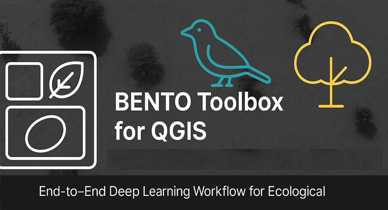

# BENTO Toolbox for QGIS

BENTO is an open-source toolbox for geospatial deep learning, integrated directly into QGIS.
It provides an end-to-end workflow for:
- automated mask generation,
- model training (YOLO, Detectron2),
- model evaluation (FiftyOne),
- and deployment back to GIS.

## Why BENTO?
Conservation, restoration, and biodiversity monitoring increasingly rely on high-resolution imagery from drones and satellites to quantify change on the ground.
Traditional workflows require switching between GIS software, Python scripts, and ML frameworks — which is slow, hard to reproduce, and often inaccessible to non-technical users.
BENTO solves this by keeping everything in one place: QGIS.

## Core Workflow
1. Mask Creation — Generate training masks using the Segment Anything Model (SAM v2).
2. Model Training — Train YOLOv8/11/12 or Mask R-CNN (Detectron2) with your own annotations.
3. Evaluation — View performance metrics (mAP@50, precision, recall) and visual diagnostics in FiftyOne.
4. Deployment — Run inference on new rasters and get GIS-ready shapefiles of detections/segments.

## Example Use Cases
- Pelican colony detection and counting from drone imagery
- Tree crown segmentation in tropical savanna landscapes
- Seal detection and morphometrics in coastal surveys

## Installation & Source
Full install instructions, developer notes, and roadmap are available in the README of the repository.

Get the code:
https://github.com/<your-username>/BENTO-QGIS-Toolbox

## Citation
If you use this toolbox in a scientific workflow, please cite:
Esparon, A. et al. (2025). BENTO: An open-source modular toolbox for geospatial deep learning in QGIS.

---

### Contact
Lead developer: Andrew Esparon
Remote Sensing AI Scientist
GitHub: https://github.com/<your-username>
